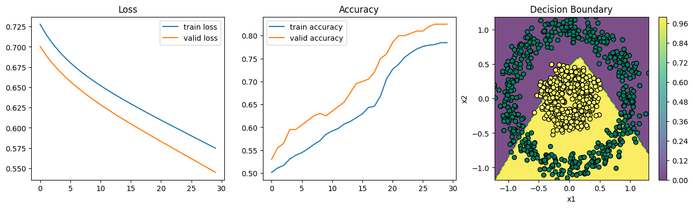

# Data Science

## Circular Data
### Hyperparameters
```
lr = 1e-3
batch_size = None
epochs = 30
optimizer = optimizers.SGD(learning_rate=lr)
loss = BCELoss()
metrics = ['accuracy']
validation_data = (x_val, y_val)
```

### 1-layer Multilayer Perceptron

```
Model(
    Dense((2, 1), activation=Sigmoid)
)
```
#### Training
<table>
  <tr>    
    <th>Learning Curves</th>
  </tr>
  <tr>
    <td rowspan="3"></td>
  </tr>
</table>

#### Evaluation
<table>
  <tr>    
    <th>Metric</th>
    <th>Train</th>
    <th>Validation</th>
    <th>Test</th>
  </tr>
  <tr>
    <td>Accuracy</td>
    <td>0.5527</td>
    <td>0.54</td>
    <td>0.5625</td>
  </tr>
</table>

<br/>

### 2-layer Multilayer Perceptron

```
Model(
    Dense((2, 2), activation=ReLU)
    Dense((2, 1), activation=Sigmoid)
)
```

#### Training
<table>
  <tr>    
    <th>Learning Curves</th>
  </tr>
  <tr>
    <td rowspan="3"></td>
  </tr>
</table>

#### Evaluation
<table>
  <tr>    
    <th>Metric</th>
    <th>Train</th>
    <th>Validation</th>
    <th>Test</th>
  </tr>
  <tr>
    <td>Accuracy</td>
    <td>0.7847</td>
    <td>0.825</td>
    <td>0.7375</td>
  </tr>
</table>

<br/>

### 3-layer Multilayer Perceptron

```
Model(
    Dense((2, 4), activation=ReLU)
    Dense((4, 3), activation=ReLU)
    Dense((3, 1), activation=Sigmoid)
)
```

#### Training
<table>
  <tr>    
    <th>Learning Curves</th>
  </tr>
  <tr>
    <td rowspan="3"></td>
  </tr>
</table>

#### Evaluation
<table>
  <tr>    
    <th>Metric</th>
    <th>Train</th>
    <th>Validation</th>
    <th>Test</th>
  </tr>
  <tr>
    <td>Accuracy</td>
    <td>0.8916</td>
    <td>0.89</td>
    <td>0.8</td>
  </tr>
</table>

<br/>

### 4-layer Multilayer Perceptron

```
Model(
    Dense((2, 10), activation=ReLU)
    Dense((10, 8), activation=ReLU)
    Dense((8, 5), activation=ReLU)
    Dense((5, 1), activation=Sigmoid)
)
```

#### Training
<table>
  <tr>    
    <th>Learning Curves</th>
  </tr>
  <tr>
    <td rowspan="3"></td>
  </tr>
</table>

#### Evaluation
<table>
  <tr>    
    <th>Metric</th>
    <th>Train</th>
    <th>Validation</th>
    <th>Test</th>
  </tr>
  <tr>
    <td>Accuracy</td>
    <td>0.9986</td>
    <td>1.0</td>
    <td>1.0</td>
  </tr>
</table>
